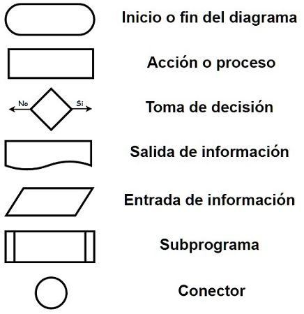

# Solución ejercicio 1
A continuación se enlista los distintos símbolos que se relacionan con la creación de diagramas de flujo, específicamente en el área de la programación:  

  

Adicionalmente, se cuenta con conectores, los cuales son usualmente indicados con un símbolo de flecha que conecta a los elementos del diagrama.

# Elementos Clave de un Diagrama de Flujo en Programación

Un **diagrama de flujo** es la representación gráfica de un algoritmo o un proceso lógico. Utiliza una serie de símbolos estándar conectados por flechas para mostrar el paso a paso de cómo se ejecuta un programa.

A continuación, se detallan los elementos fundamentales que lo componen:

---

## 1. Símbolos Básicos y su Significado

Cada figura geométrica en un diagrama de flujo tiene un propósito específico dentro de la lógica de programación:

| Símbolo | Nombre | Descripción en Programación |
| :--- | :--- | :--- |
| 🟢 / 🔴 | **Terminal / Inicio o Fin** | Representa el punto de partida (Inicio) y el punto de cierre (Fin) del algoritmo. Suele tener forma ovalada o de óvalo alargado. |
| ➡️ | **Líneas de Flujo / Direccionales** | Son flechas que indican el orden de ejecución de las operaciones (la dirección en la que fluye el proceso). |
| 🔲 | **Proceso / Acción** | Representa cualquier tipo de operación que cambie los valores de los datos, como asignaciones, operaciones aritméticas (ej. `x = a + b`) o cálculos. Su forma es un rectángulo. |
| 📥 / 📤 | **Entrada y Salida (I/O)** | Indica la introducción de datos (lectura desde teclado u otro dispositivo) o la presentación de resultados (impresión en pantalla). Tiene forma de paralelogramo. |
| 💠 | **Decisión / Condicional** | Representa una bifurcación basada en una condición lógica (preguntas como `¿X > 10?`). Tiene dos salidas posibles: **Sí/Verdadero** o **No/Falso**. Su forma es un rombo. |
| ⭕ | **Conector (Dentro de la página)** | Se usa para conectar diferentes partes de un diagrama complejo dentro de la misma hoja, evitando que las líneas se crucen. Es un círculo pequeño. |

---

## 2. Estructuras de Control Comunes

Al combinar estos elementos, se construyen las estructuras de control fundamentales de la programación:

### A. Secuencial
Las instrucciones se ejecutan una tras otra de manera lineal (un proceso sigue inmediatamente al anterior).

### B. Condicional (Selección)
Se utiliza el símbolo de **Decisión (Rombo)**. 
* Si la condición se cumple, el flujo toma un camino.
* Si no se cumple, toma otro camino alternativo (ramas `if`, `else`).

## 3. Buenas Prácticas para su Elaboración

Para que un diagrama de flujo sea útil y fácil de entender por otros programadores, se recomienda seguir estas reglas:

1. **Dirección clara:** Los diagramas deben leerse de **arriba hacia abajo** y de **izquierda a derecha**.
2. **Evitar cruces de líneas:** Las líneas de flujo no deben cruzarse; para ello existen los conectores.
3. **Texto conciso:** Las descripciones dentro de las figuras deben ser breves, utilizando verbos en infinitivo (ej. *Calcular*, *Leer*, *Mostrar*).
4. **Un solo punto de entrada y salida:** Todo diagrama debe tener un único inicio y un único fin claramente definidos.
