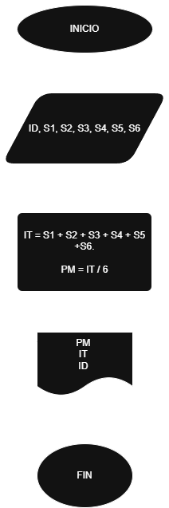
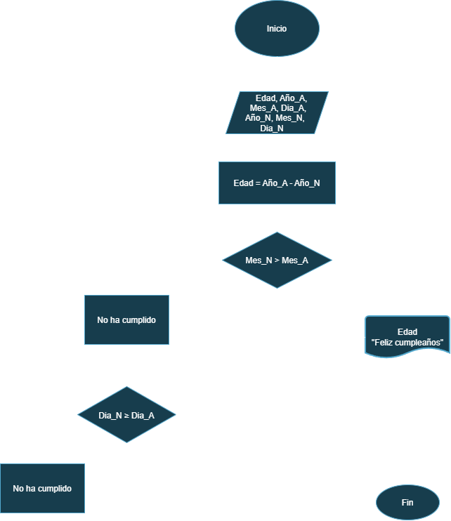
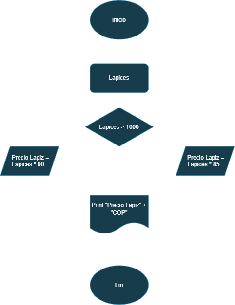
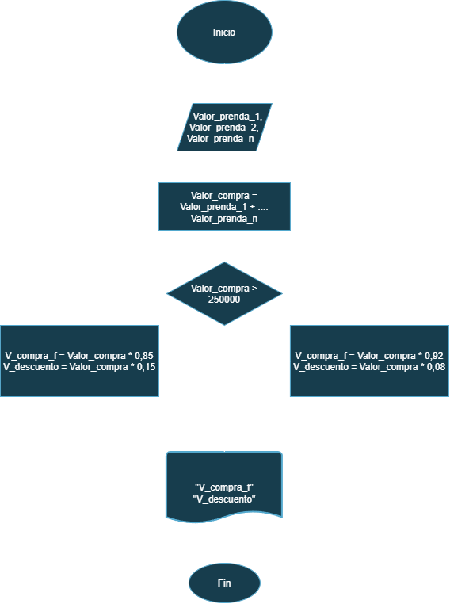

# 🔀 Repertorio de Ejercicios: Diagramas de Flujo

Bienvenido a este repositorio de ejercicios de lógica de programación. Aquí encontrarás una colección de problemas resueltos paso a paso mediante diagramas de flujo, los cuales fueron otorgados por el profesor.  

---

## 💵 Ejercicio #1 

- Construye un algoritmo que, al recibir como datos el ID del empleado y los seis primeros sueldos del año, calcule el ingreso total semestral y el promedio mensual, e imprima el ID del empleado, el ingreso total y el promedio mensual.
<div align="center">
 
### *Tabla de datos (entradas & salidas)*

| Nombre | Definición | Tipo | Entrada/Salida |
|:---:|:---:|:---:|:---:|
| ID | Identificación | Int | Entrada |
| Sn | Salario mensual | Int | Entrada  |
| IT | Ingreso total | Int | Salida |
| PM | Promedio mensual | Int | Salida |

</div>  

 ### *Pseudocodigo*
```
Inicio
Leer S1, S2, S3, S4, S5, S6, ID
Ingreso total = S1 + S2 + S3 + S4 + S5 + S6
Promedio mensual = Ingreso total / 6
Mostrar "ID"
Fin
``` 
  
<div align="center">

### *Diagrama de flujo*


</div>  

---
## 🎂 Ejercicio #2

- Diagrama de flujo para verificar si una persona ya cumplio o no ha cumplido años segun el dia en el que se encuentre el año.  

<div align="center">
 
### *Tabla de datos (entradas & salidas)*

| *Nombre* | *Definición* | *Tipo* | *Entrada/Salida* |
|:---|:---|:---:|:---:|
| Edad | Edad de la persona | Int | Salida |
| Año_A | Año actual | Int | Entrada  |
| Mes_A | Mes actual | Int | Entrada |
| Dia_A | Dia actual | Int | Entrada |
| Año_N | Año nacimiento | Int | Entrada |
| Mes_N | Mes nacimiento | Int | Entrada  |
| Dia_N | Dia nacimiento | Int | Entrada |

</div>  

 ### *Pseudocodigo*
```
Inicio
Leer Año_A, Mes_A , Dia_A, Año_N, Mes_N, Dia_N
Edad = Año_A - Año_N
Si Mes_N < Mes_A
 Print Edad, HBD

Si Dia_N ≤ Dia_A
 Print Edad, HBD

Fin
``` 
<div align="center">
  


</div>  

---

## 🐟 Ejercicio #3

- Un acuario necesita determinar cuántos litros o galones (eso lo decide el usuario) de agua caben en un acuario, pero solo dispone de una cinta métrica (en centímetros). Diseña un algoritmo para solucionar el problema.

<div align="center">
 
### *Tabla de datos (entradas & salidas)*

| Nombre | Definición | Tipo | Entrada/Salida |
|:---|:---:|:---:|:---:|
| Forma_TNQ  | Forma del tanque | Int | Entrada |
| Largo | Largo del tanque | Int | Entrada  |
| Ancho | Ancho del tanque | Int | Entrada |
| Alto | Alto del tanque | Int | Entrada |
| Vol_Litros | Volumen del tanque en litros | Int | Salida |
| Vol_Gal | Volumen del tanque en galones | Int | Salida |

</div>

```
Inicio
Leer Forma_TNQ, Largo, Ancho, Alto
Si Forma_TNQ = Rectangulo
 Vol_cm^3 = Largo * Ancho * Alto
 Vol_Litros = Vol_cm^3 / 1000
 Print Vol_Litros

Si el usuario desea la información en galones
 Vol_Galones = Vol_Litros / 3,785
 Print "Vol_litros

Fin
```


## ✏️ Ejercicio #4

- Realice un algoritmo para determinar cuánto se debe pagar por equis cantidad de lápices considerando que si son 1000 o más el costo es de $85 cada uno; de lo contrario, el precio es de $90. Represéntelo con el pseudocódigo y el diagrama de flujo.

### Pseudocodigo
```
Inicio
 Leer "Lapices"  
  Si lapices ≥ 1000  
   Precio lapices = lapices * 85  

  Si no  
   Precio lapices = lapices * 90  

 Print "Precio lapices" + "COP"  
```


## 👕 Ejercicio #5

- Un almacén de ropa tiene una promoción: por compras superiores a $250 000 se les aplicará un descuento de 15%, de caso contrario, sólo se aplicará un 8% de descuento. Realice un algoritmo para determinar el precio final que debe pagar una persona por comprar en dicho almacén y de cuánto es el descuento que obtendrá. Represéntelo mediante el pseudocódigo y el diagrama de flujo.

  ### Pseudocodigo
  
```
  Inicio  
  Leer Valor compra  
   Si Valor_compra > 250.000  
    V_compra_f = Valor compra * 0,85  
    V_descuento = Valor compra * 0,15   

  Si no   
   V_compra_f2 = Valor compra * 0,92  
   V_descuento2 = Valor compra * 0,08  

  Print  
  V_compra_f, V_descuento, V_compra_f2, V_descuento2  
```


## ✈️ Ejercicio #6


