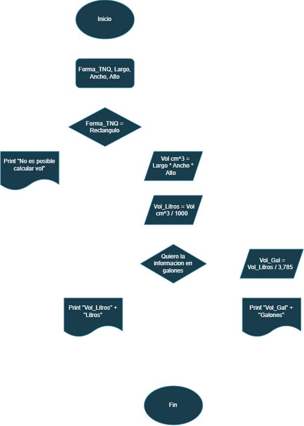

# 🔀 Repertorio de Ejercicios: Diagramas de Flujo

Bienvenido a este repositorio de ejercicios de lógica de programación. Aquí encontrarás una colección de problemas resueltos paso a paso mediante diagramas de flujo, los cuales fueron otorgados por el profesor.  

---

## 💵 Ejercicio #1 

- Construye un algoritmo que, al recibir como datos el ID del empleado y los seis primeros sueldos del año, calcule el ingreso total semestral y el promedio mensual, e imprima el ID del empleado, el ingreso total y el promedio mensual.

 

## 🎂 Ejercicio #2

- Diagrama de flujo para verificar si una persona ya cumplio o no ha cumplido años segun el dia en el que se encuentre el año.  

## 🐟 Ejercicio #3

- Un acuario necesita determinar cuántos litros o galones (eso lo decide el usuario) de agua caben en un acuario, pero solo dispone de una cinta métrica (en centímetros). Diseña un algoritmo para solucionar el problema.

## Ejercicio #4

- Realice un algoritmo para determinar cuánto se debe pagar por equis cantidad de lápices considerando que si son 1000 o más el costo es de $85 cada uno; de lo contrario, el precio es de $90. Represéntelo con el pseudocódigo y el diagrama de flujo.

### Pseudocodigo

Inicio
 Leer "Lapices"  
  If lapices ≥ 1000  
   Precio lapices = lapices * 85  

  If lapices < 1000  
   Precio lapices = lapices * 90  

 Print "Precio lapices" + "COP"  

![Image4](./
  
## Ejercicio #5

- Un almacén de ropa tiene una promoción: por compras superiores a $250 000 se les aplicará un descuento de 15%, de caso contrario, sólo se aplicará un 8% de descuento. Realice un algoritmo para determinar el precio final que debe pagar una persona por comprar en dicho almacén y de cuánto es el descuento que obtendrá. Represéntelo mediante el pseudocódigo y el diagrama de flujo.

  ### Pseudocodigo
  Inicio  
  Leer Valor compra  
   If Valor compra > 250.000  
    V_compra_f = Valor compra * 0,85  
    V_descuento = Valor compra * 0,15  

  Leer Valor compra ≤ 250.000  
   V_compra_f2 = Valor compra * 0,92  
   V_descuento2 = Valor compra * 0,08  

  Print  
  V_compra_f, V_descuento, V_compra_f2, V_descuento2  

![Image5](./
