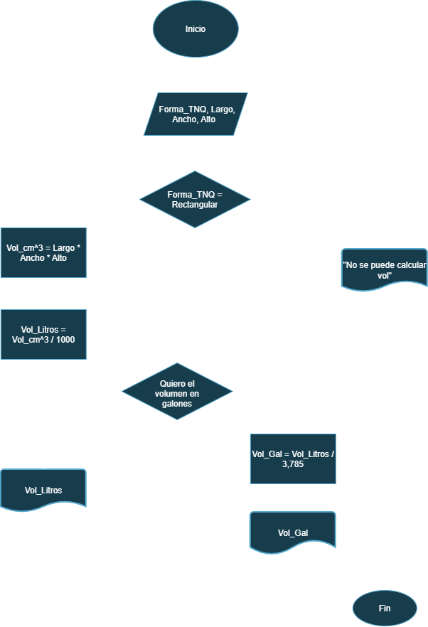
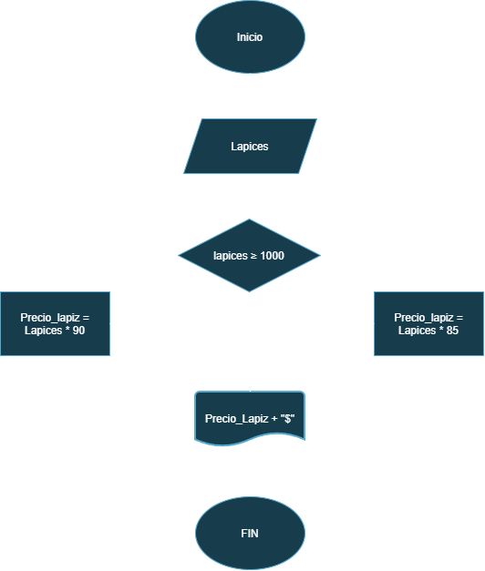
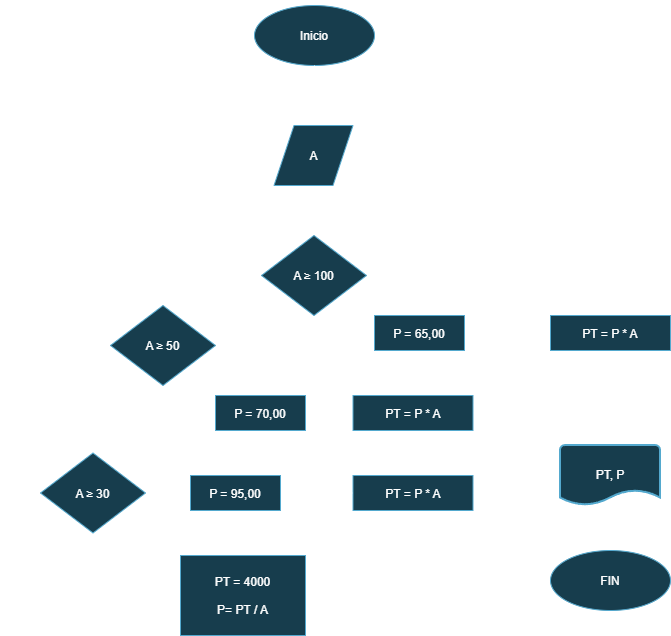
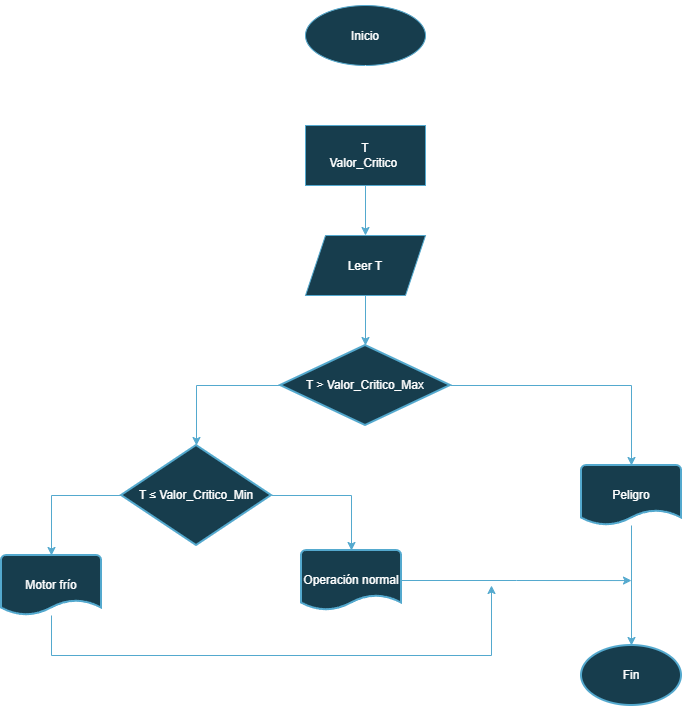

# 🔀 Repertorio de Ejercicios: Diagramas de Flujo

Bienvenido a este repositorio de ejercicios de lógica de programación. Aquí encontrarás una colección de problemas resueltos paso a paso mediante diagramas de flujo, los cuales fueron otorgados por el profesor.  

---

## 💵 Ejercicio #1 

- Construye un algoritmo que, al recibir como datos el ID del empleado y los seis primeros sueldos del año, calcule el ingreso total semestral y el promedio mensual, e imprima el ID del empleado, el ingreso total y el promedio mensual.
<div align="center">
 
### *Tabla de datos (entradas & salidas)*

| Nombre | Definición | Tipo | Entrada/Salida |
|:---:|:---:|:---:|:---:|
| ID | Identificación | Int | Entrada |
| Sn | Salario mensual | Int | Entrada  |
| IT | Ingreso total | Int | Salida |
| PM | Promedio mensual | Int | Salida |

</div>  

 ### *Pseudocodigo*
```
Inicio
Leer S1, S2, S3, S4, S5, S6, ID
Ingreso total = S1 + S2 + S3 + S4 + S5 + S6
Promedio mensual = Ingreso total / 6
Mostrar "ID"
Fin
``` 
  
<div align="center">

### *Diagrama de flujo*


</div>  

---
## 🎂 Ejercicio #2

- Diagrama de flujo para verificar si una persona ya cumplio o no ha cumplido años segun el dia en el que se encuentre el año.  

<div align="center">
 
### *Tabla de datos (entradas & salidas)*

| *Nombre* | *Definición* | *Tipo* | *Entrada/Salida* |
|:---|:---|:---:|:---:|
| Edad | Edad de la persona | Int | Salida |
| Año_A | Año actual | Int | Entrada  |
| Mes_A | Mes actual | Int | Entrada |
| Dia_A | Dia actual | Int | Entrada |
| Año_N | Año nacimiento | Int | Entrada |
| Mes_N | Mes nacimiento | Int | Entrada  |
| Dia_N | Dia nacimiento | Int | Entrada |

</div>  

 ### *Pseudocodigo*
```
Inicio
Leer Año_A, Mes_A , Dia_A, Año_N, Mes_N, Dia_N
Edad = Año_A - Año_N
Si Mes_N < Mes_A
 Print Edad, HBD

Si Dia_N ≤ Dia_A
 Print Edad, HBD

Fin
``` 
<div align="center">
  


</div>  

---

## 🐟 Ejercicio #3

- Un acuario necesita determinar cuántos litros o galones (eso lo decide el usuario) de agua caben en un acuario, pero solo dispone de una cinta métrica (en centímetros). Diseña un algoritmo para solucionar el problema.

<div align="center">
 
### *Tabla de datos (entradas & salidas)*

| Nombre | Definición | Tipo | Entrada/Salida |
|:---|:---:|:---:|:---:|
| Forma_TNQ  | Forma del tanque | Int | Entrada |
| Largo | Largo del tanque | Int | Entrada  |
| Ancho | Ancho del tanque | Int | Entrada |
| Alto | Alto del tanque | Int | Entrada |
| Vol_Litros | Volumen del tanque en litros | Int | Salida |
| Vol_Gal | Volumen del tanque en galones | Int | Salida |

</div>

```
Inicio
Leer Forma_TNQ, Largo, Ancho, Alto
Si Forma_TNQ = Rectangulo
 Vol_cm^3 = Largo * Ancho * Alto
 Vol_Litros = Vol_cm^3 / 1000
 Print Vol_Litros

Si el usuario desea la información en galones
 Vol_Galones = Vol_Litros / 3,785
 Print "Vol_litros

Fin
```

<div align="center">



</div>

---

## ✏️ Ejercicio #4

- Realice un algoritmo para determinar cuánto se debe pagar por equis cantidad de lápices considerando que si son 1000 o más el costo es de $85 cada uno; de lo contrario, el precio es de $90. Represéntelo con el pseudocódigo y el diagrama de flujo.

<div align="center">
 
### *Tabla de datos (entradas & salidas)*

| Nombre | Definición | Tipo | Entrada/Salida |
|:---|:---:|:---:|:---:|
| Lápices  | Cantidad de lapices | Int | Entrada |
| Precio Lápiz | Valor a pagar | Int | Salida

</div>

### Pseudocodigo
```
Inicio
 Leer "Lapices"  
  Si lapices ≥ 1000  
   Precio lapices = lapices * 85  

  Si no  
   Precio lapices = lapices * 90  

 Print "Precio lapices" + "COP"
Fin
```
<div align="center">



</div>

---

## 👕 Ejercicio #5

- Un almacén de ropa tiene una promoción: por compras superiores a $250 000 se les aplicará un descuento de 15%, de caso contrario, sólo se aplicará un 8% de descuento. Realice un algoritmo para determinar el precio final que debe pagar una persona por comprar en dicho almacén y de cuánto es el descuento que obtendrá. Represéntelo mediante el pseudocódigo y el diagrama de flujo.

<div align="center">
 
### *Tabla de datos (entradas & salidas)*

| Nombre | Definición | Tipo | Entrada/Salida |
|:---|:---:|:---:|:---:|
| Valor_prenda_n  | Precio de prenda | Float | Entrada |
| Valor_compra_f  | Valor total pagado | Float | Salida |
| Valor_descuento_f  | Valor del descuento aplicado | Float | Salida |

</div>


  ### Pseudocodigo
  
```
  Inicio  
  Leer Valor compra  
   Si Valor_compra > 250.000  
    V_compra_f = Valor compra * 0,85  
    V_descuento = Valor compra * 0,15   

  Si no   
   V_compra_f2 = Valor compra * 0,92  
   V_descuento2 = Valor compra * 0,08  

Print V_compra_f, V_descuento, V_compra_f2, V_descuento2
Fin
```

<div align="center">
 


</div>

---

## ✈️ Ejercicio #6

- El director de una escuela está organizando un viaje de estudios, y requiere determinar cuánto debe cobrar a cada alumno y cuánto debe pagar a la compañía de viajes por el servicio. La forma de cobrar es la siguiente: si son 100 alumnos o más, el costo por cada alumno es de $65.00; de 50 a 99 alumnos, el costo es de $70.00, de 30 a 49, de $95.00, y si son menos de 30, el costo de la renta del autobús es de $4000.00, sin importar el número de alumnos.

<div align="center">
 
### *Tabla de datos (entradas & salidas)*

| Nombre | Definición | Tipo | Entrada/Salida |
|:---:|:---:|:---:|:---:|
| A | Cantidad de Alumnos | Int | Entrada |
| P | Precio | Float | Salida |
| PT | Precio total | Float | Salida |

</div>

```
  Inicio  
   
```

<div align="center">
 


</div>

---

# Taller de Algoritmos: Ejercicios Prácticos

Este documento contiene una recopilación estructurada de los ejercicios desarrollados durante el taller de algoritmos. El objetivo principal de esta colección es aplicar el pensamiento computacional para la resolución de problemas, documentando paso a paso cada solución mediante el uso de pseudocódigo y diagramas de flujo. 

A continuación, se presenta la lista de ejercicios abordados:

## Ejercicio condicional

🔥**Control de temperatura del motor**🔥
    
Durante una inspección de rutina, se mide la temperatura de un motor de turbina. Si la temperatura es mayor a un valor crítico, se debe indicar "Peligro: sobrecalentamiento". Si está dentro del rango seguro, indicar "Operación normal". Si es demasiado baja, indicar "Motor frío – Calentar antes de operar".

<div align="center">
 
### *Tabla de datos (entradas & salidas)*

| Nombre | Definición | Tipo | Entrada/Salida |
|:---:|:---:|:---:|:---:|
| T | Temperatura motor | Float | Entrada |
| Valor_critico | Valor definido por usuario | Float | Entrada|
| Alerta | Mensaje emitido segun la alerta | Text | salida |

</div>

``` 
    Definir T Como Real
    Definir Valor_Critico como real

    Escribir "Ingrese la temperatura actual del motor (en grados):"
    Leer T
    
    Si T > Valor_critico Entonces
        Escribir "Peligro: sobrecalentamiento"
    Sino Si T >= Valor_critico Entonces
        Escribir "Operación normal"
    Sino
        Escribir "Motor frío – Calentar antes de operar"
    Fin Si
    
Fin 
```
<div align="center">

 ### Diagrama de Flujo
 


</div>

## Ejercicio bucle


## Ejercicio complejo (condicional & bucle

